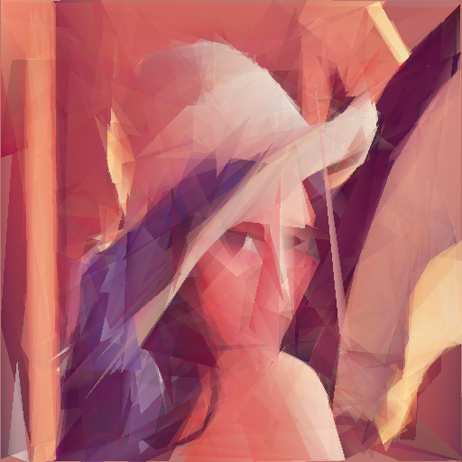

# Triangles

This code approximates an image using only triangles. All work is done on the GPU using OpenGL drawing and compute shaders.

It works by drawing a fixed amount of random triangles (100 by default) and comparing them to the reference image via Mean Square Error. On each iteration we randomly mutate a single value from the triangle array and re-evaluate the error again. If it decreases we keep the change, otherwise we revert it. By brute forcing this at GPU speeds, we can get visible results pretty quickly.

```
Usage:
  triangles [OPTIONS] IMAGE

Approximates an image with random triangles

Positional arguments:
  image                 Input image file

Optional arguments:
  -h,--help             Show this help message and exit
  -t,--tex-size TEX_SIZE
                        Texture size used in computations
  -n,--num-tris NUM_TRIS
                        Number of triangles in approximation
  -d,--draw-interval DRAW_INTERVAL
                        Display the result after N iterations
  -o,--output OUTPUT    Output image filename (saved on exit)
```

## Example output

```
image: img/Lenna.png
texture size: 512
num triangles: 300
drawing every 1000 iters
average color: [0.50554484, 0.17099285, 0.16232914, 1.0]
1504572 iters in 411.069255484s (4252 iters/s) error: 0.010000365         
saving image to img/Lenna_triangles.png
```

 Original                  | Triangles
:-------------------------:|:--------------------------------------:
 | 
